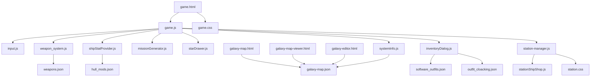

# `/game` folder guide

This document explains every file currently under `/game`, what it is used for, and where it connects to other files.

## High-level structure

- **Core gameplay**: [`game.html`](./game.html), [`game.js`](./game.js), [`game.css`](./game.css), input/render/combat helpers.
- **Station + shop UIs**: station manager/shop scripts, shop HTML pages, related CSS/JSON data.
- **Galaxy tools**: galaxy map runtime, viewer, and editor pages with shared JSON data.
- **Data files**: weapons, outfits, hull mods, and galaxy map JSON.
- **Demos**: standalone HTML experiments under [`demo/`](./demo/).
- **Planning notes**: roadmap and task scratch files.

---

## File-by-file reference

### Root `/game` files

| File | Purpose | Links / Related files |
|---|---|---|
| [`const.js`](./const.js) | Defines base path constants for runtime asset loading in browser environments (local vs GitHub Pages). | Used by runtime pages like [`game.html`](./game.html), [`galaxy-map.html`](./galaxy-map.html), and scripts that fetch JSON assets. |
| [`game.html`](./game.html) | Main game entry page. Loads the core game runtime and UI assets. | Uses [`game.js`](./game.js), [`game.css`](./game.css), and gameplay helpers such as [`input.js`](./input.js), [`weapon_system.js`](./weapon_system.js). |
| [`game.js`](./game.js) | Main gameplay loop/state orchestration: player ship flow, combat/state updates, high-level integration of modules. | Integrates [`input.js`](./input.js), [`shipStatProvider.js`](./shipStatProvider.js), [`missionGenerator.js`](./missionGenerator.js), [`weapon_system.js`](./weapon_system.js), [`starDrawer.js`](./starDrawer.js), and data JSONs. |
| [`game.css`](./game.css) | Core game HUD and page styling for the main game experience. | Paired with [`game.html`](./game.html). |
| [`input.js`](./input.js) | Keyboard/controller input setup and binding helpers for gameplay interaction. | Called from [`game.js`](./game.js). |
| [`weapon_system.js`](./weapon_system.js) | Weapon behavior and loading helpers (including remote/local weapons JSON handling). | Reads [`weapons.json`](./weapons.json), used by [`game.js`](./game.js). |
| [`shipStatProvider.js`](./shipStatProvider.js) | Provides ship/enemy stat templates and related computed values. | Consumed by [`game.js`](./game.js); conceptually tied to [`hull_mods.json`](./hull_mods.json) and outfit data. |
| [`missionGenerator.js`](./missionGenerator.js) | Mission generation logic and mission payload assembly. | Used by [`game.js`](./game.js); can be informed by [`systemInfo.js`](./systemInfo.js). |
| [`systemInfo.js`](./systemInfo.js) | Shared system metadata structure/constants used by gameplay and map views. | Related to [`galaxy-map.json`](./galaxy-map.json), [`missionGenerator.js`](./missionGenerator.js). |
| [`starDrawer.js`](./starDrawer.js) | Canvas starfield/background rendering utility. | Used by [`game.js`](./game.js) and/or demo pages. |
| [`inventoryDialog.js`](./inventoryDialog.js) | Inventory UI rendering logic (dialog/list rendering and interactions). | Tied to runtime state from [`game.js`](./game.js) and shop/outfit data. |
| [`station-manager.js`](./station-manager.js) | Station scene and docking management logic. | Pairs with [`station.css`](./station.css), [`stationShipShop.js`](./stationShipShop.js), and station/shop HTML pages. |
| [`stationShipShop.js`](./stationShipShop.js) | Station ship shop rendering + purchase action wiring. | Used by station/game UIs; connected to [`spaceship-shop.html`](./spaceship-shop.html) and station flow in [`station-manager.js`](./station-manager.js). |
| [`station.css`](./station.css) | Station-specific UI styling (docking/shop overlays and related components). | Used by station pages/scripts such as [`station-manager.js`](./station-manager.js). |
| [`spaceship-shop.html`](./spaceship-shop.html) | Standalone spaceship shop page. | Uses station/shop scripts such as [`stationShipShop.js`](./stationShipShop.js) and style files. |
| [`outfits-shop.html`](./outfits-shop.html) | Standalone outfit shop page/UI shell. | Uses outfit data from [`software_outfits.json`](./software_outfits.json), [`outfit_cloacking.json`](./outfit_cloacking.json). |
| [`galaxy-map.html`](./galaxy-map.html) | In-game galaxy map view page. | Reads [`galaxy-map.json`](./galaxy-map.json), related to [`systemInfo.js`](./systemInfo.js). |
| [`galaxy-map-viewer.html`](./galaxy-map-viewer.html) | Viewer/debug page for galaxy map visualization. | Reads [`galaxy-map.json`](./galaxy-map.json), complements [`galaxy-map.html`](./galaxy-map.html). |
| [`galaxy-editor.html`](./galaxy-editor.html) | Editor page used to edit or inspect galaxy map/system layout content. | Works with [`galaxy-map.json`](./galaxy-map.json), with outputs consumed by map pages. |
| [`galaxy-map.json`](./galaxy-map.json) | Source-of-truth galaxy topology/system data file. | Consumed by [`galaxy-map.html`](./galaxy-map.html), [`galaxy-map-viewer.html`](./galaxy-map-viewer.html), and gameplay/system logic. |
| [`weapons.json`](./weapons.json) | Weapon definitions (stats/properties/effects metadata). | Loaded by [`weapon_system.js`](./weapon_system.js) and used by [`game.js`](./game.js). |
| [`hull_mods.json`](./hull_mods.json) | Hull modifier definitions/configuration for ships. | Related to ship computations in [`shipStatProvider.js`](./shipStatProvider.js) and shop/game systems. |
| [`software_outfits.json`](./software_outfits.json) | Outfit software/item dataset used by outfit/shop systems. | Used by outfit UIs such as [`outfits-shop.html`](./outfits-shop.html), inventory/shop logic. |
| [`outfit_cloacking.json`](./outfit_cloacking.json) | Cloaking/outfit-specific data list used by equipment systems. | Related to [`software_outfits.json`](./software_outfits.json) and outfit/shop UI pages. |
| [`roadmap.md`](./roadmap.md) | Planning notes and implementation ideas (project TODO direction). | Related to active development tasks, including gameplay/map/shop files. |
| [`task.txt`](./task.txt) | Lightweight task scratchpad/checklist. | Developer note companion to [`roadmap.md`](./roadmap.md). |
| [`readme.md`](./readme.md) | This documentation file. | Links to all `/game` files. |

### `/game/demo` files

These are sandbox/demo pages used to test specific visual systems, factions, shops, effects, or gameplay slices.

| File | Purpose | Links / Related files |
|---|---|---|
| [`demo/demo-common.html`](./demo/demo-common.html) | Shared/common demo setup variant. | Related variants: [`demo-common-jared.html`](./demo/demo-common-jared.html), core scripts like [`../game.js`](./game.js). |
| [`demo/demo-common-jared.html`](./demo/demo-common-jared.html) | Common demo configured for “jared” themed assets/entities. | Extends/relates to [`demo-common.html`](./demo/demo-common.html). |
| [`demo/demo-jared.html`](./demo/demo-jared.html) | Demo focused on Jared faction/unit behavior. | Related to [`demo-jared-capital.html`](./demo/demo-jared-capital.html), ship stats in [`../shipStatProvider.js`](./shipStatProvider.js). |
| [`demo/demo-jared-capital.html`](./demo/demo-jared-capital.html) | Jared capital ship-focused demo scenario. | Related to [`demo-jared.html`](./demo/demo-jared.html). |
| [`demo/demo-zeus.html`](./demo/demo-zeus.html) | Zeus-themed ship/effect demo. | Uses shared gameplay/render logic from parent scripts. |
| [`demo/demo-spaceships.html`](./demo/demo-spaceships.html) | Spaceship-focused demo scene. | Related to [`demo-spaceships1.html`](./demo/demo-spaceships1.html), [`../shipStatProvider.js`](./shipStatProvider.js). |
| [`demo/demo-spaceships1.html`](./demo/demo-spaceships1.html) | Alternate spaceship demo variant. | Companion to [`demo-spaceships.html`](./demo/demo-spaceships.html). |
| [`demo/demo-human-drones.html`](./demo/demo-human-drones.html) | Human drone behavior/combat demo. | Related to enemy/ship data in [`../shipStatProvider.js`](./shipStatProvider.js). |
| [`demo/demo-attack-human-spaceships.html`](./demo/demo-attack-human-spaceships.html) | Attack scenario against human ships. | Uses combat systems from [`../weapon_system.js`](./weapon_system.js), [`../game.js`](./game.js). |
| [`demo/demo-hyperspace.html`](./demo/demo-hyperspace.html) | Hyperspace transition/visual behavior demo. | Related to map/system context in [`../systemInfo.js`](./systemInfo.js). |
| [`demo/interstellarGate.html`](./demo/interstellarGate.html) | Interstellar gate concept/demo page. | Related to hyperspace/map demos and [`../galaxy-map.json`](./galaxy-map.json). |
| [`demo/demo-planets.html`](./demo/demo-planets.html) | Planet rendering/scene demo. | Related to star/background rendering via [`../starDrawer.js`](./starDrawer.js). |
| [`demo/demo-stations.html`](./demo/demo-stations.html) | Station presentation/interaction demo. | Related to [`../station-manager.js`](./station-manager.js), [`../station.css`](./station.css). |
| [`demo/demo-detailed-station.html`](./demo/demo-detailed-station.html) | More detailed station layout/interaction demo. | Companion to [`demo-stations.html`](./demo/demo-stations.html). |
| [`demo/demo-technicians.html`](./demo/demo-technicians.html) | Technicians-themed demo scene. | Related to [`demo-technicians-capital.html`](./demo/demo-technicians-capital.html), [`demo-technicians-outfits`](./demo/demo-technicians-outfits). |
| [`demo/demo-technicians-capital.html`](./demo/demo-technicians-capital.html) | Technicians capital ship/station variant demo. | Companion to [`demo-technicians.html`](./demo/demo-technicians.html). |
| [`demo/demo-technicians-outfits`](./demo/demo-technicians-outfits) | Technicians outfit demo page (file without `.html` extension). | Related to outfit data in [`../software_outfits.json`](./software_outfits.json). |
| [`demo/demo-shop.html`](./demo/demo-shop.html) | Shop interaction demo page. | Related to [`../outfits-shop.html`](./outfits-shop.html), [`../spaceship-shop.html`](./spaceship-shop.html). |
| [`demo/demo-shop1.html`](./demo/demo-shop1.html) | Alternate shop demo variant 1. | Companion to [`demo-shop.html`](./demo/demo-shop.html). |
| [`demo/demo-shop1-jared.html`](./demo/demo-shop1-jared.html) | Shop demo variant tuned for Jared content. | Related to [`demo-shop1.html`](./demo/demo-shop1.html). |
| [`demo/demo-shop1-technicians.html`](./demo/demo-shop1-technicians.html) | Shop demo variant tuned for technicians content. | Related to [`demo-shop1.html`](./demo/demo-shop1.html). |
| [`demo/demo-shop-immagini-reali.html`](./demo/demo-shop-immagini-reali.html) | Shop demo with “real images” asset variant. | Companion to other shop demos and outfit/shop data files. |
| [`demo/demo-outfits.html`](./demo/demo-outfits.html) | Outfit-specific UI/logic demo. | Related to [`../software_outfits.json`](./software_outfits.json), [`../outfit_cloacking.json`](./outfit_cloacking.json). |
| [`demo/demo-engine-flare.html`](./demo/demo-engine-flare.html) | Engine flare visual effects demo. | Related to rendering/game loop assets in [`../game.js`](./game.js). |
| [`demo/simple3d.html`](./demo/simple3d.html) | Minimal 3D experiment page. | Standalone experiment; may still use shared constants/scripts like [`../const.js`](./const.js). |

---

## Mermaid diagram (JavaScript relationships)

> Note: demo pages under [`/game/demo`](./demo/) usually reuse the same core scripts/components but vary by scenario, assets, and test focus.
